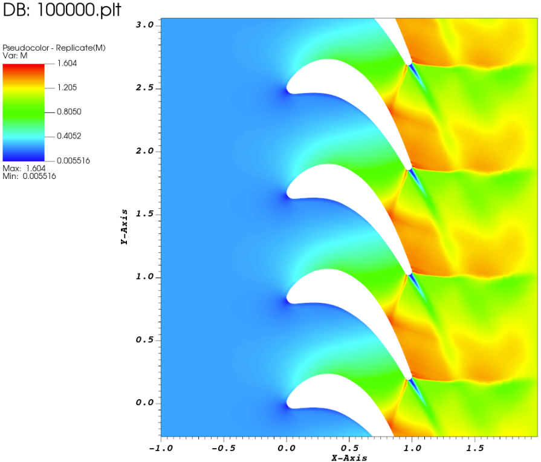
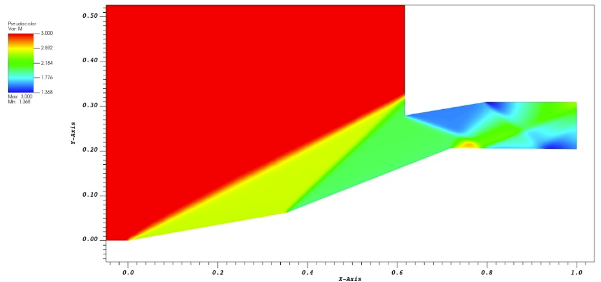

# 2D Compressible CFD Solver

A custom Computational Fluid Dynamics (CFD) solver developed to numerically integrate the 2D Euler equations (inviscid Navier-Stokes) for compressible flows. 

Developed as part of the M.Sc. in Aerospace Engineering curriculum at Politecnico di Torino, this project bridges high-performance Fortran computing with Python automation.

## Project Overview
The core solver is written entirely in Fortran to maximize computational efficiency when evaluating complex flow fields. To streamline the engineering workflow, a robust Python wrapper was developed to handle the entire pre-processing and post-processing pipeline.

* **Pre-processing:** Automated grid generation using Python and the `gmsh` API (supporting unstructured, quadrilateral-dominant meshes, and inflation layers).
* **Core Solver:** Fortran-based numerical integration using density-based schemes.
* **Post-processing:** Python scripts for automated data extraction, residual tracking, and field visualization (Mach, Pressure, Entropy).

## Results plot

Below are plotted the mach number fields for the LS59 turbine blade cascade (on the left) and for the supersonic intake (on the right). From the plots it can be clearly seen the regions of supersonic and subsonic flow, along with shock waves and Prandtl-Meyer expansion fans.

 


## Numerical Methods Implemented
* **Schemes:** Implementation of Lax-Friedrichs and Roe (approximate Riemann solver) schemes.
* **Convergence Verification:** Advanced grid convergence studies using L2-norm entropy tracking and Richardson Extrapolation (evaluating both theoretical and effective convergence orders).
* **Stability:** Courant–Friedrichs–Lewy (CFL) condition analysis for transient stability.

## Validated Test Cases
The solver has been rigorously tested and cross-validated against commercial software (ANSYS Fluent) and experimental data across multiple flow regimes:

1. **Subsonic Channel with Bump:** Grid convergence study for internal flows.
2. **LS59 Turbine Blade Cascade:** Transonic/supersonic flow analysis, highlighting expansion waves and trailing edge interactions.
   
3. **Supersonic Double Ramp Intake:** Simulation of complex high-speed phenomena, effectively capturing oblique shock waves and expansion fans.
   

## Shape Optimization (modeFRONTIER)
The project also includes a multi-objective shape optimization study of a converging-diverging nozzle. Driven by modeFRONTIER, the workflow aimed to find the Pareto front balancing two conflicting goals:
* Maximizing the thrust coefficient ($C_F$).
* Minimizing the nozzle wall mass.

## Getting Started
### Prerequisites
* Fortran Compiler (e.g., `gfortran`)
* Python 3.x with `gmsh`, `numpy`, and `matplotlib`

### Running a Simulation
1. Define your geometry and boundary conditions in the Python script.
2. Generate the mesh and execute the solver:
    ```bash
   python run_simulation.py
   ```
3. Post-processing plots will be automatically generated in the /results        directory.
